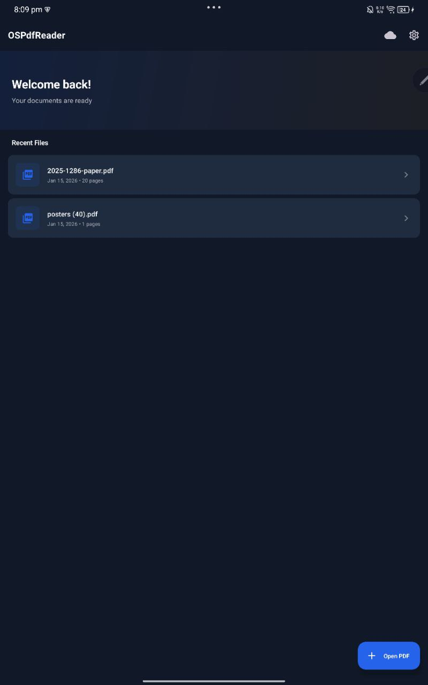
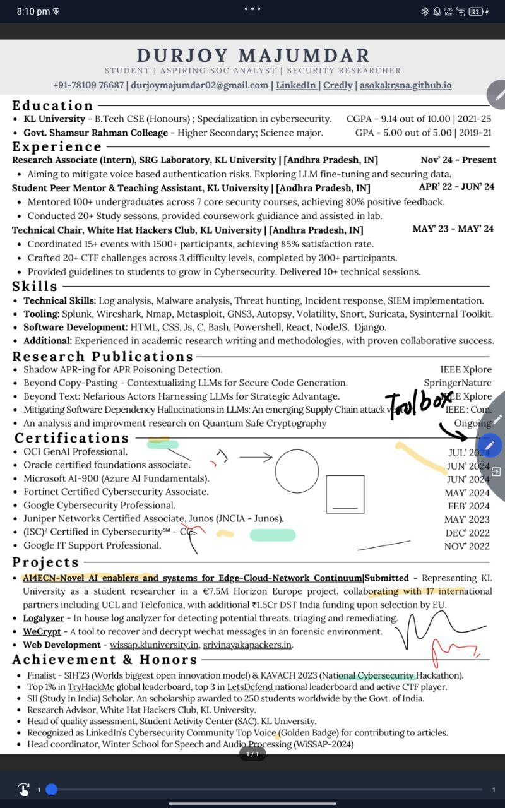
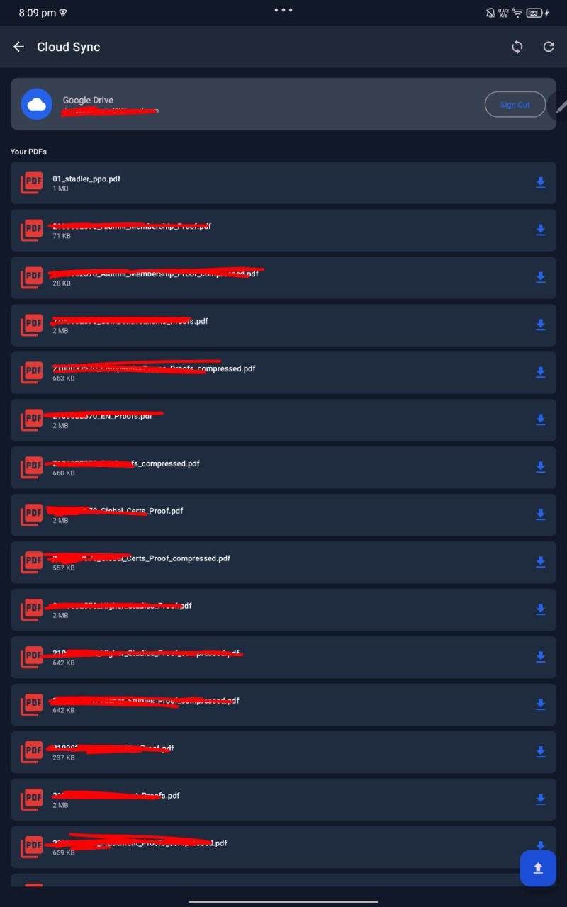
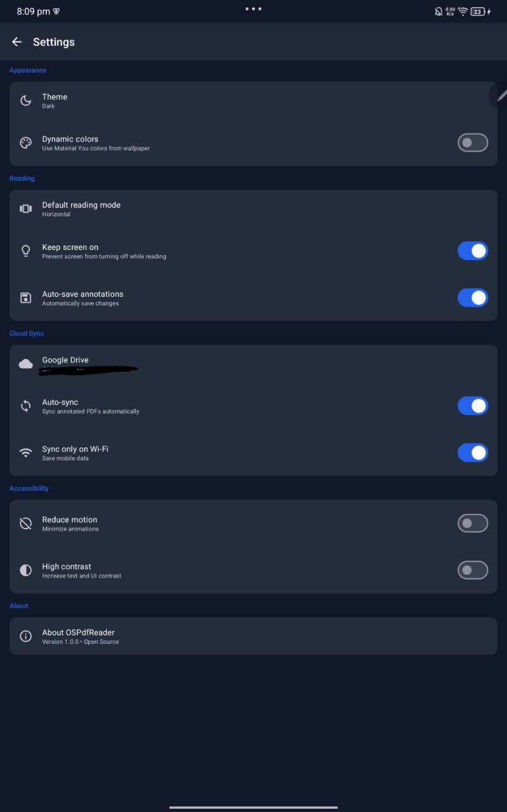
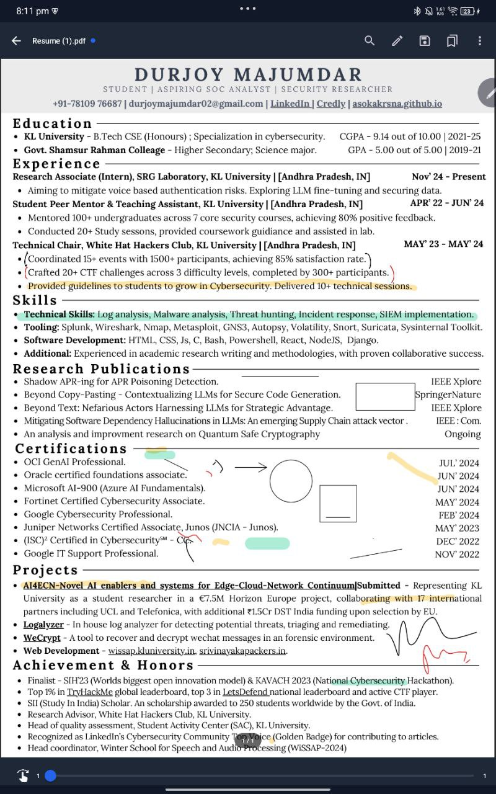
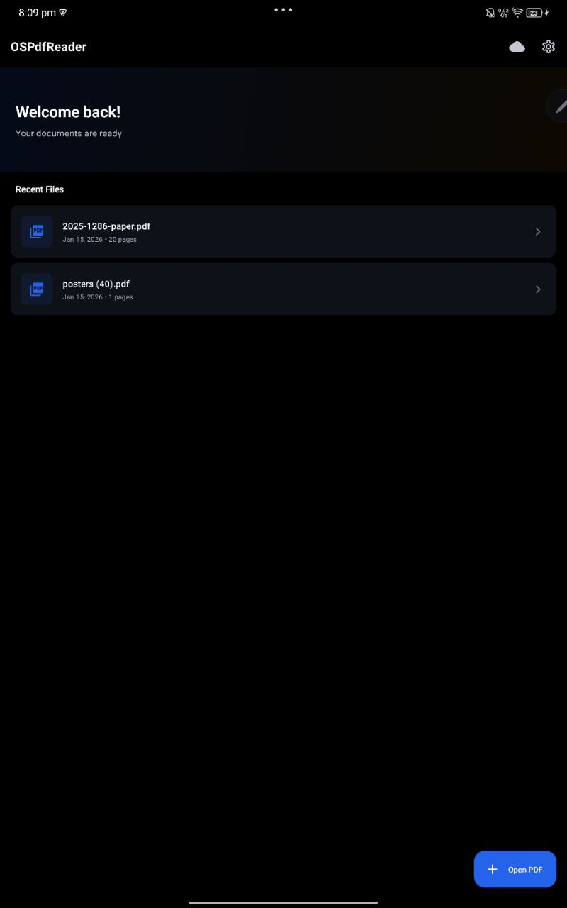
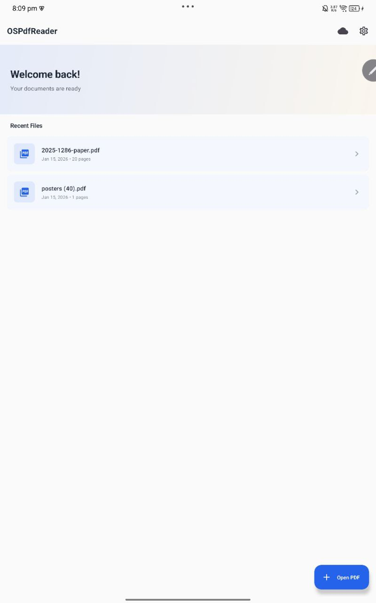

# OSPdfReader

<p align="center">
  <strong>📖 Open Source PDF Reader & Annotator for Android</strong>
</p>

<p align="center">
  <em>Free forever. No ads. No paywalls. Just reading.</em>
</p>

---

## 🆕 Recent Updates

**v1.0.1** (January 2026)
- ✅ Fixed page swipe navigation (horizontal & vertical modes)
- ✅ Improved zoom gestures: pinch-to-zoom + double-tap to zoom (Somr glithy behaviour is there.)

---

## 💡 Why OSPdfReader?

Being frustrated with paywalls locking basic PDF features behind subscriptions, this app was developed keeping personal and community needs in mind—**especially for students**—to ensure everyone has access to a quality PDF reading and annotation tool with cloud backup, completely free.

**OSPdfReader** (Open Source PDF Reader) is determined to remain **free and open source forever**. The code is yours to inspect, modify, and improve.

> 🤖 *This app was mostly vibe-coded using [Antigravity IDE](https://antigravity.dev) and Claude Opus 4.5 model.*

---

## ✨ Features

| Feature | Description |
|---------|-------------|
| 📖 **PDF Reading** | Smooth rendering with horizontal swipe (book mode) and vertical scroll |
| ✏️ **Annotations** | Pen, highlighter, shapes with multiple colors and stroke widths |
| 🔍 **Full-text Search** | Search across all pages instantly |
| 🔤 **OCR** | Offline text recognition for scanned documents (Tesseract) |
| ☁️ **Google Drive Sync** | Backup and sync your annotated PDFs ([Setup Guide](docs/GOOGLE_DRIVE_SETUP.md)) |
| 🌙 **Multiple Themes** | Light, Dark, AMOLED, and Dynamic Colors (Material You) |
| ♿ **Accessibility** | Reduce motion, high contrast, keep screen on |
| 🖊️ **Stylus Support** | Pressure-sensitive inking for stylus users |
| ↩️ **Undo/Redo** | Full undo/redo support for annotations |
| 📁 **Recent Files** | Quick access to recently opened documents |

---

## 📱 Screenshots









---

## 🛠️ Building

### Requirements
- Android Studio Hedgehog (2023.1.1) or later
- JDK 17
- Android SDK 34

### Steps

```bash
# Clone the repository
git clone https://github.com/asokakrsha/OSPdfReader.git
cd OSPdfReader

# Build debug APK
./gradlew assembleDebug

# Or open in Android Studio and run 
```

---
 
## 🏗️ Architecture

| Component | Technology |
|-----------|------------|
| **UI** | Jetpack Compose + Material 3 |
| **PDF Engine** | MuPDF |
| **OCR** | Tesseract4Android |
| **DI** | Hilt |
| **Database** | Room |
| **Preferences** | DataStore |
| **Background Sync** | WorkManager |
| **Architecture** | MVVM + Clean Architecture |

---

## 🤝 Contributing

Contributions are welcome! Whether it's:

- 🐛 Bug reports
- ✨ Feature requests  
- 📝 Documentation improvements
- 💻 Code contributions

Please open an issue first to discuss significant changes.

---

## 🔒 Security

Security researchers are requested for **responsible disclosure**. If you discover a vulnerability, please:

1. **Do not** open a public issue
2. Email the maintainers privately
3. Allow reasonable time for a fix before disclosure

---

## 📄 License

This project is licensed under the **GNU Affero General Public License v3.0 (AGPL-3.0)**.

This means:
- ✅ You can use, modify, and distribute this software
- ✅ You must keep it open source
- ✅ Any modifications must also be released under AGPL-3.0
- ✅ Network use counts as distribution (no closed-source SaaS)

**Its not permitted to take this codebase and make it closed source.**

See [LICENSE](LICENSE) for the full license text.

> MuPDF is licensed under AGPL-3.0 © Artifex Software, Inc.

---

## 💬 Feedback

Any recommendations and suggestions are welcome! Open an issue or start a discussion.

---

## 🙏 Acknowledgments

- [MuPDF](https://mupdf.com/) for the excellent PDF rendering engine
- [Tesseract](https://github.com/tesseract-ocr/tesseract) for OCR capabilities
- Material Design team for the design system
- The open source community ❤️

---

<p align="center">
  <strong>Made with ❤️ for students and open source community</strong>
</p>
